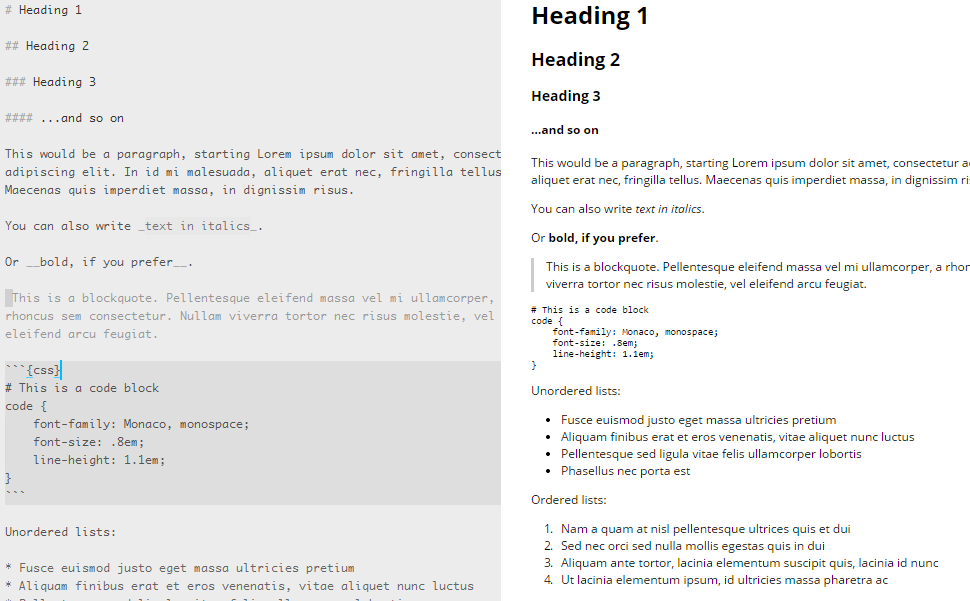
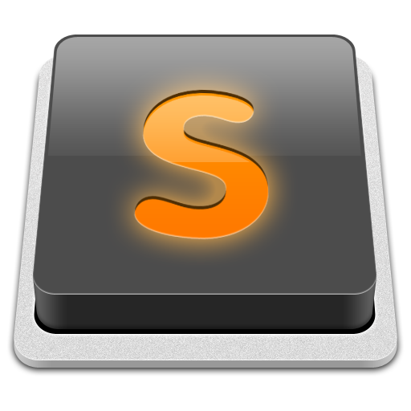
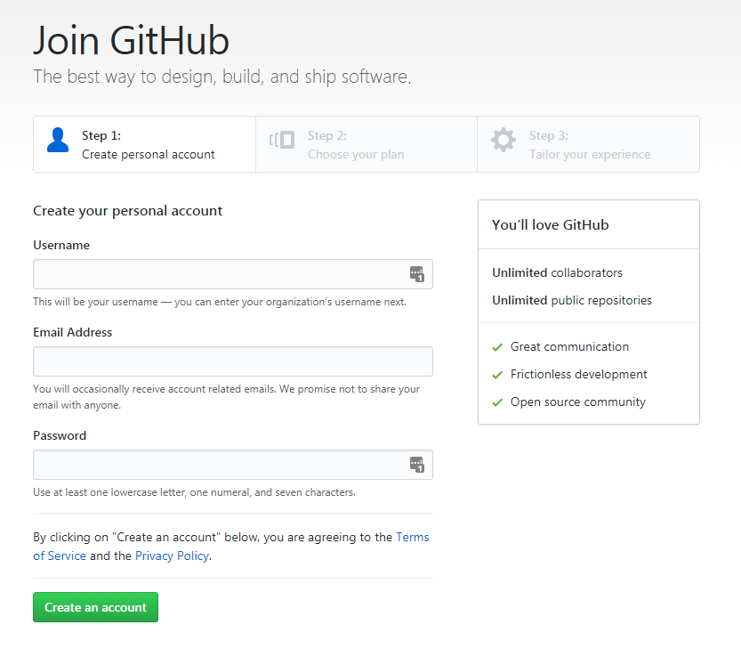

% Introducción a GitHub

## Qué es y cómo funciona git

### ¿Qué hay de nuevo?

[Git para usuarios de Dropbox](git-para-usuarios-dropbox.md)

-------

Dropbox | git
--------|-----
guarda versiones de archivos | guarda versiones del proyecto completo
gestión de conflictos | archivos corruptos

--------

Dropbox | git
--------|-----
archivos borrados, máx 30 días (o de pago) | todos los estados del proyecto 

--------

Dropbox | git
--------|-----
todo es automático | partes importantes son manuales

-------

Funcionamiento de Dropbox:

1. Instalas Dropbox
2. Alguien comparte una carpeta contigo
3. Tu ordenador descarga los contenidos de esa carpeta desde _la nube_
4. Haces algunos cambios a un archivo en la carpeta y los guardas
5. Tus cambios se suben inmediatamente a _la nube_ en Dropbox
6. Los cambios se descargan a los ordenadores de los demás inmediatamente

----

En cambio, con Git:

4. Haces algunos cambios a un archivo en la carpeta y los guardas. Los confirmas mediante `commit`
5. Tus cambios se suben <del>inmediatamente a _la nube_ en Dropbox</del> cuando haces `push`
6. Los cambios se descargan a los ordenadores de los demás <del>inmediatamente</del> cuando hacen `pull`

---

Además, cambia el orden y añade algunos pasos:

6, 4, 6, 5

Es decir, haces `pull`, modificas el archivo, lo guardas, haces `commit`, haces `pull`, haces `push`. El proyecto completo con tus cambios incluidos ya está en la nube.

----

Flujo de trabajo revisado para Git (1 de 2):

1. Haces `pull` para descargar una versión actualizada del proyecto
2. Modificas los archivos necesarios, los guardas, y cuando la modificación tiene sentido propio, haces `commit`. Repite este paso tantas veces como sea necesario

---

Flujo de trabajo revisado para Git (2 de 2):

3. Vuelves a hacer `pull` para incorporar los cambios de los demás. En este punto podrías tener que resolver conflictos
4. Haces `push`. El proyecto y su histórico ya está actualizado y en la nube

---

### Diferencias avanzadas

----

#### Viajes en el tiempo

----

Del libro oficial de Git, [Pro Git](https://git-scm.com/book/es/v2/Inicio---Sobre-el-Control-de-Versiones-Fundamentos-de-Git):

>Cada vez que confirmas (`commit`) un cambio, o guardas el estado de tu proyecto en Git, básicamente toma una foto del aspecto de todos tus archivos en ese momento, y guarda una referencia a esa copia instantánea. (...)

---

Del libro oficial de Git, [Pro Git](https://git-scm.com/book/es/v2/Inicio---Sobre-el-Control-de-Versiones-Fundamentos-de-Git):

>(...) Para ser eficiente, si los archivos no se han modificado, Git no almacena el archivo de nuevo, sino un enlace al archivo anterior idéntico que ya tiene almacenado. Git maneja sus datos como una secuencia de copias instantáneas.

----


----

#### Conflictos 

----

Generalmente Git funciona de manera bastante inteligente y sabrá proponer una resolución satisfactoria, salvo que la modificación se haya realizado sobre la misma línea del archivo. 

### Sugerencias para los commits

----

- Cambios pequeños. Haz un commit cada vez que una modificación o serie de modificaciones tenga sentido en sí misma
- Resume con un infinitivo y de manera informativa en qué ha consistido el cambio (ej. "Cambiar mi salario")
- Es mucho más fácil gestionar las modificaciones y los conflictos sobre documentos de **texto plano (como HTML o Markdown)**

## Markdown

------

La sintaxis de Markdown es simple y fácil de recordar.

------



-----

Títulos de sección:

```
# Titular de primer nivel

## Titular de segundo nivel

###### Titular de sexto nivel
```
----

Resaltados:

```
*cursiva*
_cursiva_

**negrita**
__negrita__
```

----

Listas:

```
- una
- lista
- desordenada

* una 
* lista
* desordenada
```

----

Listas:

```
1. una
2. lista
3. ordenada

1. una
1. lista
1. ordenada
```

----

Enlaces:

```
[Texto de enlace](http://direccion.com)
```

----

[Ver más elementos de sintaxis &raquo;](../markdown.md)

### Cómo usar Markdown en nuestro equipo

----

1. Instalar [Sublime Text 3](http://sublimetext.com/3)



----

Con esto ya tenemos lo básico. Pero vamos a hacer que la experiencia sea aún más cómoda:

2. Instalar el paquete Package Control: [instrucciones](https://packagecontrol.io/installation)

Esto es un gestor o instalador de paquetes (o plugins, o extensiones)

----

3. Instalar algunos paquetes:
    - WordCount
    - MarkdownEditing

Para esto, hacer clic en `Ctrl+Mayus+P` y empezar a escribir _package_. Aparecerá la lista de comandos del control de paquetes. Seleccionar `Install package` y presionar `Enter`. Empezar a escribir el nombre del paquete, seleccionar el deseado y presionar `Enter`. Reiniciar Sublime Text. 

----

Para cuando estemos haciendo trabajos de redacción, una manera aún más cómoda de trabajar con el texto sin distracciones es utilizando el modo sin distracciones (_Distraction Free Mode_), al que se accede presionando `Mayus+F11` (y se desactiva de la misma manera).

----

Más adelante, si os interesa, podemos ver cómo convertir estos documentos de texto plano en _documentos tradicionales_ en formato PDF, incluso Word, o incluso presentaciones (¡como esta!.

## Volviendo a Git: GitHub

----

GitHub es una plataforma que aloja repositorios Git. Es una de las muchas posibles _nubes_ para nuestros repositorios Git. 

### Crear una cuenta en GitHub

----

